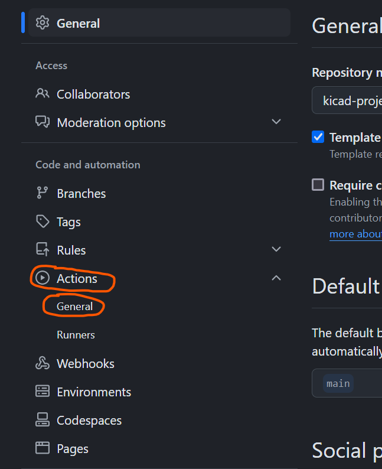

# kicad project template

a cool table showing the workflow of all the kicad projects.
| project_name | DRC | ERC |
| ------------ | --- | --- |
| template | [✅](https://github.com/sirlilpanda/kicad-project-template/actions/runs/11885615488/attempts/1#summary-33115574474)| [✅](https://github.com/sirlilpanda/kicad-project-template/actions/runs/11885615488/attempts/1#summary-33115574623) | 

for a quick guide check [project setup](#project-setup)

This is a simple project template for new kicad projects. This template has some basic setup already completed such as workflows for auto creating all the things you forget when creating a kicad project such as:

- [gerbers](https://github.com/sirlilpanda/kicad-project-template/tree/main/Hardware/template_PCB/template_grbr.zip)
- [bom](https://github.com/sirlilpanda/kicad-project-template/tree/main/Hardware/template_DOCS/BOM/template_bom_report.md)
- [schematic pdf](https://github.com/sirlilpanda/kicad-project-template/tree/main/Hardware/template_DOCS/template_schematic.pdf)

This workflow will also run the design rules check on the PCB and schematic to ensure that you upload a working PCB. These reports are uploaded as summaries within the github [actions tab](https://github.com/sirlilpanda/kicad-project-template/actions/runs/11885615488). This template has a simple schematic PCB in it (because DRC fails on an empty PCB). Shown below is the example PCB.

besides from that the project also has:

- common predefined trace widths
- smallest vias size [JLCPBC allows](https://jlcpcb.com/capabilities/Capabilities#Drilling)
- custom net colours in the schematic editor
    - `red` for +V
    - `blue` for -V
    - `grey` for ground

to create a repo from this template follow this [guide](https://docs.github.com/en/repositories/creating-and-managing-repositories/creating-a-repository-from-a-template)

contained in this template are:
---
- `.github/` : all files relating to github actions and other admin see [here](https://docs.github.com/en/communities/setting-up-your-project-for-healthy-contributions) for more example of what can be placed in it
    - `report_processing` : where the python scripts are stored for processing the json report data from kicad
    - `report_templates` : where the template for said reports are stored
    - `workflows/` : this is where the github actions are kept
        - `main.yaml` : the main github action that will auto generate all files required and run DRC and ERC
    - `rename.py` : the script for renaming the project
    - `get_pcb_names.py` : the script for getting all the kicad project names to use for the matrix
- `Hardware/` : this is where the kicad project lives
    - `template_DOCS/` : all the documents related to your project is stored
        - `BOM/`     : where the bill of materials and price breakdown are kept
            - `bill_of_materials.csv`: the auto generated bom for the kicad project
            - `bom_report.md` : a report for the bill of materials
        - `template_schematic.pdf` : the schematic for the kicad project, auto generated by the github action
    - `template_PCB/` : this is where the auto generated gerbers for the kicad project are stored
    - `template_PROJECT/` : this is where the kicad project actually is

- `res/` : where resources are stored for the README

- `.gitignore`: a slightly modified gitignore from the [standard one](https://github.com/github/gitignore/blob/main/KiCad.gitignore)

- `project_settings.yaml` : where the settings for this project is stored

- `README.md` : this file, suggest you change this one creating your project

## project settings
there are currently very few project settings that can be changed (will will be change in the future) these are:
| setting                   | description                                                       |
| ------------------------- | ----------------------------------------------------------------- |
|has_been_set_up            | a flag to tell the setup action if the project has been set up    | 
|project_name               | the name of the project, this will be set to the name of the repo |
|production_formats         | the output production format for the PCBs                         |
|dynamic_read_me            | allow the readme to be updated using the given template           |
|sub_pcb_names              | the names of all other kicad projects within the repo             |
|bom_template_path          | the template used to write the bom report files                   |
|erc_report_template_path   | the template used to write the erc report files                   |
|drc_report_template_path   | the template used to write the drc report files                   |
|readme_template_path       | the template used to write projects readme                        |

## project setup

### creating a new repo with the template

creating a new template from a repo is simple:

1. click on the button in the top right hand corner called `use this template`

2. when the drop down menu appears click on `create a new repository`

3. once you click you will be brought to this page, note that the repo name you choose here will be the name that you kicad project is called.

after these steps you then need to configure the repo settings to do their magic see [configuring repo settings](#configuring-repo-settings) for what to do next.

### configuring repo settings

once you have created a new repo with the template, you ill have to configure the github action settings. this is because you will get an error that looks something along these lines:

where the action can not commit the changes due to not having permissions follow these steps:
1. open the repo setting

2. then head in to actions : General

3. then scroll down to workflow permissions and ensure that both
    `Read and write permissions` and `Allow GitHub Actions to create and approve pull requests` are ticked as seen below

this should fix the problem if not, go harass stack overflow they need it
Once all of these steps have been followed the workflow should be passing, however the `README.md` will only update on the next push request.

## editing the readme

As this repo can and will automatically update the repo corresponding to the given readme template. If you dont want to use this you can always disable this by setting the `dynamic_read_me` to `false`. but if you want some very cool features like auto updating tables to show what projects are passing the rules check or simple links to parts of your directory. then have a look at the template readme and learn [mustache](https://mustache.github.io/)

## improvements
